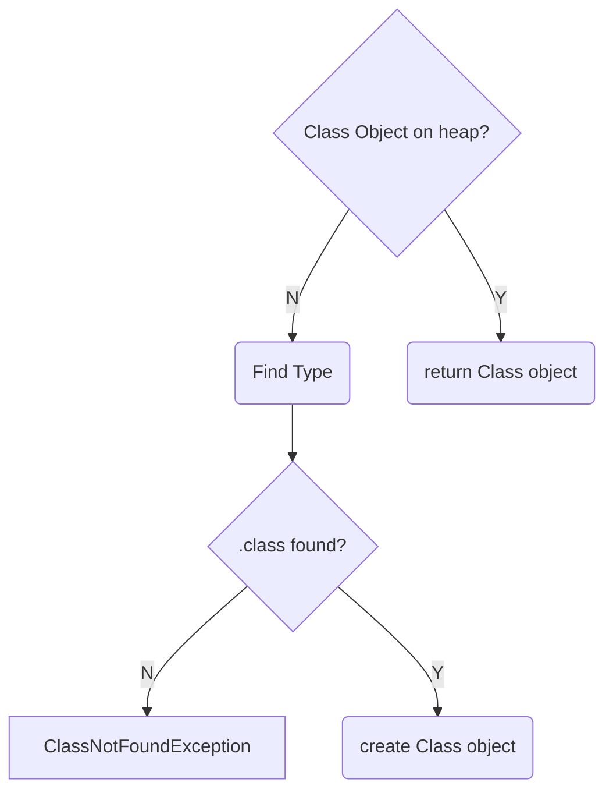
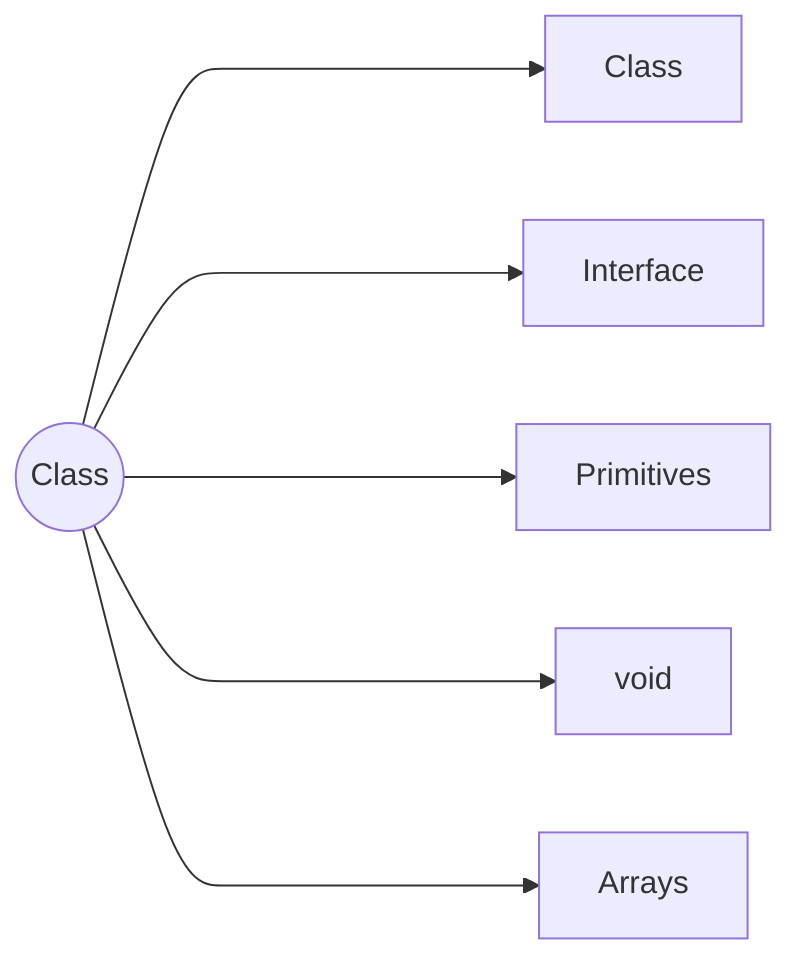

#Class Loading

##Loading Type  



##Classloaders - Parent Delegation 

```mermaid
    flowchart BT 
        id1[Application Class Loader] --> id2[Extension Class Loader]
        id2 --> id3[Bootstrap Class Loader] %% $java_home$/jre/lib/rt.jar   most trustworthy
        id4[User-Defined Class Loader] & id5[User-Defined Class Loader] --> id1  %% $java_home$/jre/lib/ext/*.jar  least trustworthy
        id6[ ] --> id4 
        id7[ ] --> id5
```

###First time loading of a Class  
- new instance is created
- Invoking static method
- Accessing static field (Exception: compile-time constants)
- Subclass is loaded
- Run from command line
- Reflection

###First time loading of an Interface  
- Invoking static method (Java 8)
- Accessing static field (Exception: compile-time constants)
- Subclass is loaded or sub-interface is loaded
- Run from command line (Java 8)
- Reflection


#Class Object
JVM uses Class object to create a new instance.




Class object contains meta -information  
    String getName()        returns name of the class   
    Class getSuperClass()   returns Superclass of the current class (Object class, primitives, void will return null)  
    boolean isInterface()   returns true if the current class is an interface  
    Class[] getInterfaces() returns all the interfaces implemented by the current class         
    Classloader getClassLoader()  returns the classloader that loaded this class
    