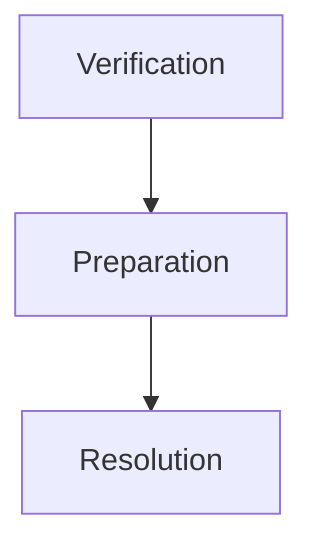

#Linking  

###Verification  
Checks for __conformity__ with language rules  

That is, it conforms to the Java language to us and this is needed as the class file might have been
loaded from across the network, or it could be a user defined class from the local file system itself.
In either case JVM does not trust those classes as they come from less trustworthy resources.   

Bytecode verification is done by the component: Java Bytecode Verifier. If the code is successfully verified by the BV, 
then the code is considered to be safe to run by the JVM. 

**Some verification checks performed by Java Bytecode Verifier**   
 
 - final classes are not subclassed
 - final methods are not overridden
 - No illegal method overloading
 - bytecode integrity
   - jump instruction (if condition) does not send VM beyond end of method   

###Preparation  
 - Allocate space for static fields 
 - Initialize them with default values.  

If there is not enough memory, then OutOfMemoryError is thrown.  
If the class is loaded because an instance of it is created, then space will be allocated for instance fields also. This
is however done after all the static fields are initialized properly with the user-defined values. Also, if it has a 
superclass then the superclass will first be initialized, then only this class will be initialized.  

###Resolution  
It is an optional step; it need not strictly happen after preparation step. It can also happen initialization stage.  
Resolves symbolic references (fields from other classes and interfaces) and loads them.  

Symbolic References  
 - Logical references
 - Stored in constant pool  
   - Constant pool includes compile-time constants and string literals too  
   - At runtime, replaced with direct references  

Dynamic Linking Approaches  
 - Eager Loading ~ after preparation
 - Lazy Loading ~ after initialization (on-demand)

Resolution Checks  
 - Permission
 - Correctness

#Initialization
